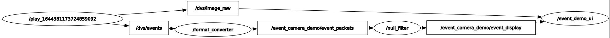

# Event Camera Demo
## Install
1. Install [`miniforge` / `mambaforge`](https://github.com/conda-forge/miniforge) or [`miniconda`](https://docs.conda.io/en/latest/miniconda.html) and enter base enviroment.

3. Install Mamba.
```
conda install mamba -c conda-forge
```

3. Clone Repository.
```
git clone https://github.com/Harl-Towne/event-camera-vpr-demonstrator.git
cd event-camera-vpr-demonstrator
git submodule init
git submodule update
```

4. Create enviroment.
```
conda env create -f environment.yml -n qcreventdemoenv
```
There is also a environment_versioned.yml which includes versions of all packages but I can't get a new envirment out of it so it's lucky that it doesn't seem to be necessary.

5. Build.
```
catkin build
# or
source init.bash
# init.bash builds then sources project
```
## Usage
### Launch Files
```
# Launch appropriate nodes with ros driver for use with camera
roslaunch main_ui camera_launch.launch 

# Launch appropriate nodes without ros driver for use with bag files (bag file sold seperatly)
roslaunch main_ui bag_launch.launch
```
### Manual Launching
Run in seperate tabs
```
## node converts dvs_msgs.EventArray to demos_msgs.EventPacket
rosrun event_format_converter node
```
```
## node for filterting events, no filter capable of real time yet
rosrun filter null.py		# no filtering
# or
rosrun filter filter.py		# with tonic filter (currently too slow for real time)
```
```
## node for the demo program itself
rosrun main_ui main.py
```

## Documentation
### Node Structure


The `format_converter` node converts `dvs_msgs.EventArray` ROS mesages to `demo_msgs.EventPacket`. This is necesary as ROS Python isn't capable of reading `EventArray` messages fasted enough to run in real time (at least not as far as I know). This node is in `event_format_converter/src/converter_node.cpp`.

The filter node filters events between the `format_converter` and `event_demo_ui` nodes. `null_filter` is a pass through filter and `tonic_filter` is intended to remove noise but currently doesn't run in real-time. The files for these nodes are in `filter/src/`.

The `event_demo_ui` node is part of the main ui of the demo itself. This code for the demo program and this node is in `main_ui/src/main.py`. This file containts two classes `EventDemoWindow` and `EventStore`. 
- `EventDemoWindow` is responsible for the main ui window, event callbacks and ROS callbacks. 
- `EventStore` is a class for storing and retriving events quickly. Internaly the events are stored as a list of numpy matricies where each matrix is an event packet. Externaly the events are accessed as if the `EventStore` is one large matrix.
